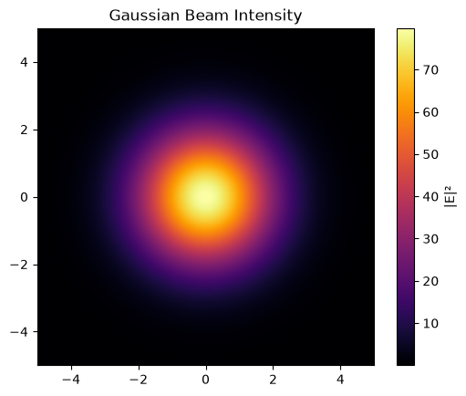
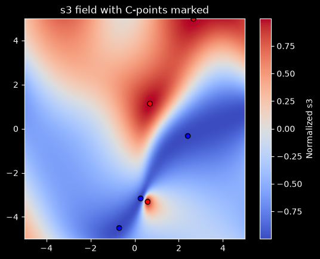

# VectorWaves

A Python library for constructing and analyzing electromagnetic fields through discrete plane-wave expansions.

## Introduction

Classical light is fundamentally an electromagnetic wave. In vacuum, electromagnetic fields admit a plane-wave decomposition, and VectorWaves is built around this principle. It provides a framework for constructing, computing, and analyzing fully three-dimensional vector fields and their topology.

VectorWaves constructs optical sources through plane-wave modes. These modes are sampled over a specified solid angle using Fibonacci-sphere quadratures. This enables the generation of a wide variety of fields, including monochromatic sources with prescribed spatial structure (Gaussian, Laguerre-Gaussian, speckle, custom profiles, etc.) as well as polychromatic fields with arbitrary spectral distributions (Gaussian, Lorentzian, custom profiles, etc.)

The computational workflow is organized into three stages. Using a Config object, the user specifies the physical system and numerical parameters. BeamMaker then generates a Beam object containing the plane wave modes. Finally, FieldEngine evaluates the resulting electromagnetic field on an individual point, observation planes, or arbitrary cloud of points. Field quantities may be computed at specific times, and multiple computational backends are available, including GPU acceleration through CuPy.

To analyze the topology of these fields, VectorWaves also provides the SingularityFinder interface. Given fields computed by a FieldEngine, singular structures such as C-points, Cᵀ-points, and Lᵀ-points can be detected on observation planes and subsequently refined on the underlying continuous field using Newton-Raphson algorithms. These refined singularities may then be used as seed points for tracing the corresponding two-dimensional singular lines throughout the three-dimensional volume.

The overall workflow is

Config → BeamMaker → Beam → FieldEngine → FieldResult

and topological analysis follows

FieldEngine + FieldResult → SingularityFinder

For convenience, the helper functions `setup_beam(Config)` and `setup_engine(Config)` provide direct access to Beam and FieldEngine respectively.

## Installation

pip install VectorWaves

## Features

- Angular-spectrum plane-wave construction using Fibonacci-sphere quadratures
- Fully three-dimensional electric and magnetic field evaluation
- Spatial derivative computation
- Monochromatic and polychromatic optical sources
- Structured beams, speckle fields, and custom source profiles
- GPU acceleration through CuPy
- Detection and tracing of polarization singularities

## Basic Usage

### Generating a Gaussian beam

```python
import matplotlib.pyplot as plt
import VectorWaves as vw

# specifying the system
config = vw.get_config()
config.backend = 'numpy'

config.op.size = (1.0, 1.0)
config.op.spacing = 0.01

config.source.wavelength = 1.0
config.source.num_modes = 15000

config.source.k_space.gaussian(sigma_k_perp=1.5)
config.source.randomize.off()

# constructing the engine using helper
engine = vw.setup_engine(config)

# computing fields
result = engine.compute_on_op(z=0.0)

# plotting intensity
plt.imshow(
    result.intensity_E,
    cmap="inferno",
    extent=engine.op_extent,
    origin="lower"
)
plt.colorbar(label="|E|²")
plt.title("Gaussian Beam Intensity")
plt.show()
```


*Intensity cross-section of a Gaussian beam generated by VectorWaves.*

### Finding C points in a speckle cross-section

To generate a speckle field, stochastic phase and amplitude are left enabled.
```python
import matplotlib.pyplot as plt
import VectorWaves as vw

# specifying the system
config = vw.get_config()
config.op.size = (1.0, 1.0)
config.op.spacing = 0.01

config.source.wavelength = 1.0
config.source.num_modes = 15000

config.source.k_space.gaussian(sigma_k_perp=1.5)
# stochastic phase and amplitude variations are enabled by default

# constructing the engine
engine = vw.setup_engine(config)

# computing fields
result = engine.compute_on_op(z=0.0)
Ex, Ey, Ez = result.E

# utility function for stokes parameters
s_all = vw.get_stokes_params(Ex, Ey, normalize=True) 

# finding C points
finder = vw.SingularityFinder(engine)
c_points = finder.find_stokes_C_points(z_value=0.0, E_grid=result.E)

# Keep only singularities whose refinement converged
cp_positions = [pt['position'] for pt in c_points if pt['confident']]
cp_handedness = [pt['handedness'] for pt in c_points if pt['confident']]

# plot positions and handedness of C points
if cp_positions:
    x, y, z = zip(*cp_positions)
    plt.scatter(x, y, c=cp_handedness, cmap='bwr', edgecolor='k', zorder=5)

# plot s3 field
plt.imshow(s_all['s3'], cmap='coolwarm', origin='lower', extent=engine.op_extent)
plt.colorbar(label='Normalized s3')
plt.title('s3 field with C-points marked')
plt.show()
```


*Normalized Stokes s₃ field with detected C-points overlaid.*


## Further Reading

These examples only demonstrate the basic workflow.

For a detailed introduction to the underlying physics, source construction, polychromatic fields, volumetric field evaluation, derivative computation, and singularity tracing, see the tutorials and API documentation at https://1rayokelvin.github.io/VectorWaves.