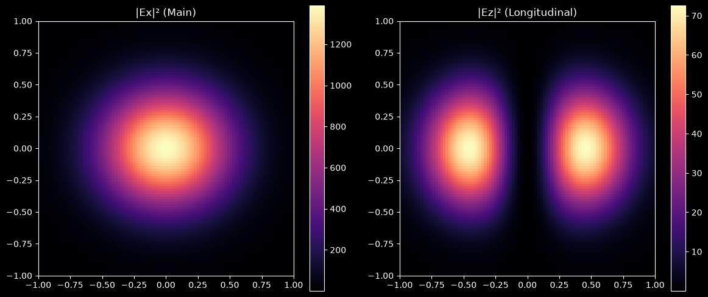

# VectorWaves

A Python library for constructing and analyzing electromagnetic fields through discrete plane-wave expansions.

Classical light is fundamentally an electromagnetic wave. In vacuum, electromagnetic fields admit a plane-wave decomposition, and VectorWaves provides a framework for constructing, computing, and analyzing fully three-dimensional vector fields and their topological structures.

**For full documentation, basic usage, and tutorials, visit the [official documentation site](https://1rayokelvin.github.io/VectorWaves).**

## Installation

```bash
pip install VectorWaves
```

For additional features, you can install optional dependencies:

| Extra | Purpose |
|---------|---------|
| `viz` | Matplotlib and PyVista for visualizations |
| `progress` | Progress bars via tqdm |
| `gpu` | CUDA acceleration via CuPy |
| `all` | All the above |

To install, 
```bash
pip install vectorwaves[#Extra]
```

## Features

- **Exact 3D Fields**: Electric, Magnetic fields and spatial derivatives via Fibonacci-sphere discrete plane-wave expansions.
- **Monochromatic Source Models**: Built-in source definitions and arbitrary user-defined spatial spectra.
- **Polychromatic Source Models**: Built-in spectral distributions and arbitrary user-defined spectral profiles.
- **Advanced Topology**: Detect and trace polarization singularities (C, Cᵀ, and Lᵀ points/lines).
- **Physical Diagnostics**: Easily compute Stokes parameters and polarization ellipses for quick visuals.
- **Stochastic Fields**: Built-in randomization for generating speckles and unpolarized fields.
- **High Performance**: Hierarchical configuration with seamless switching between CPU (`numpy`, `numba`) and GPU (`cupy`) backends.

## Quick Tour: The Power of Plane-Wave Superposition

Because VectorWaves natively superposes true 3D plane-wave vectors, it effortlessly captures complex non-paraxial vector effects that scalar FFT propagators miss entirely. 

For example, when you tightly focus a linearly polarized Gaussian beam, a longitudinal (z-direction) electric field and a clover-like cross-polarized field naturally emerge purely from the geometry of the converging wavevectors.

```python
import matplotlib.pyplot as plt
plt.style.use('dark_background')
import numpy as np
import vectorwaves as vw

# 1. Configure a tightly focused, x-polarized Gaussian beam
config = vw.get_config()
config.op.size = (2,2); config.op.spacing = 0.02
config.source.pol_vect = (1, 0)
config.source.k_space.gaussian(sigma_k_perp=2.0) # High divergence
config.source.theta_max = np.pi/2 # Allow modes up to 90 degrees
config.source.randomize.off()

# 2. Construct the engine and compute the exact vector field at the focus
engine = vw.setup_engine(config)
result = engine.compute_on_op(z=0.0)

# 3. Extract the intensity of x and z components
Ex, Ey, Ez = result.E
I_x, I_z = np.abs(Ex)**2, np.abs(Ez)**2

# Plotting the two intensities
fig, (ax1, ax2) = plt.subplots(1, 2, figsize=(12,5))
extent = engine.op_extent

im1 = ax1.imshow(I_x, extent=extent, cmap='magma'); ax1.set_title("|Ex|² (Main)")
im2 = ax2.imshow(I_z, extent=extent, cmap='magma'); ax2.set_title("|Ez|² (Longitudinal)")

fig.colorbar(im1, ax=ax1); fig.colorbar(im2, ax=ax2)
plt.tight_layout()
plt.show()
```


*(Note the colorbar scales: the solver automatically calculates the correct relative magnitudes of the emergent longitudinal components without any paraxial approximations).*

### Ready to learn more?
For a gentler introduction covering basic configurations, spectral envelopes, or fully 3D field visualizations, head over to the **[Getting Started Guide](https://1rayokelvin.github.io/VectorWaves)**.